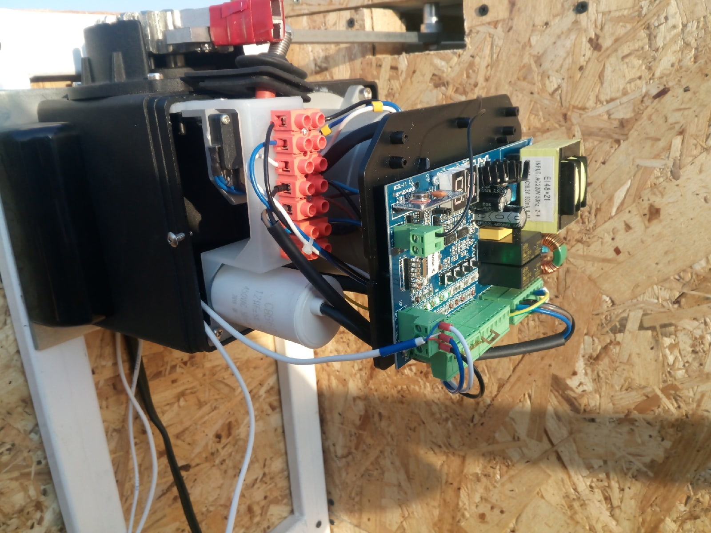
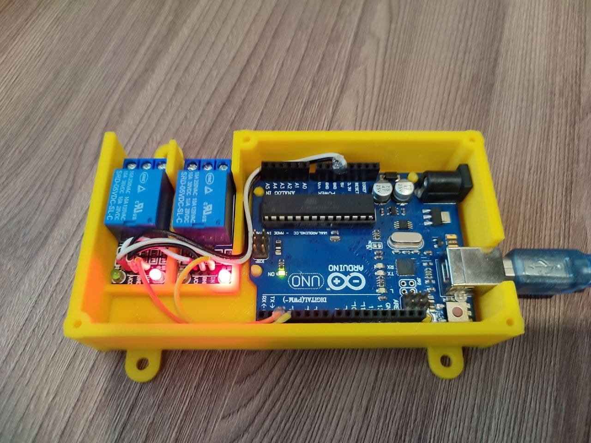

Observatory Roof Controller
===============

This project is a fork of the original INDI Aldiroof author [Derek OKeeffe](https://github.com/dokeeffe/indi-aldiroof).
In my project, I used a different roof drive, which is controlled by only two signals - OPEN and CLOSE. 
An [INDI](http://indilib.org/) driver and arduino firmware to control a roll off roof of an astronomical observatory.


The roof of the astronomical observatory is driven by a motor and a sliding gate reducer.
Two relays and an Arduino controller are used to control the engine controller.
For safety, the roof end positions and parking sensors (reed switches) of the telescope are connected to the controller.
The Arduino controller communicates with the INDI driver using the firmata protocol.



----------------------
## Hardware Parts List

1. Arduino UNO controller (or any other).
2. 4 X 30A arduino relays module.
3. Linux machine running INDI server (install the driver on).
4. (Optional) 3D printed case.

## Building / Installing Software

1. Flash the firmware to your arduino using the arduino ide.
2. Build and install the driver on the machine running indi server.

## Install in INDI web manager
To add a driver to the INDI Web Manager list, edit the following file and add the section **Domes** lines to the list:  
`/usr/share/indi/drivers.xml`

```
<device label="Aldi Roof">
  <driver name="Aldi Roof">indi_aldiroof</driver>
  <version>1.0</version>
</device>
```

